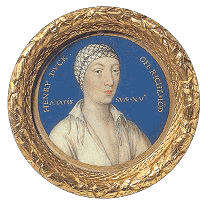

# Horenbout

Handles miniature paintings called **favicons**, alongside browserconfig.xml and webmanifest.
/!\ This project is a work in progress. Very limited functionalities for now.

## Doc

TBD

## Contributing

Yes please! You can take a loot at [CONTRIBUTING](CONTRIBUTING.md).
This repo also features a [Discussions](https://github.com/I-is-as-I-does/Euclid/discussions) tab.

## License

This project is under the MIT License; cf. [LICENSE](LICENSE) for details.